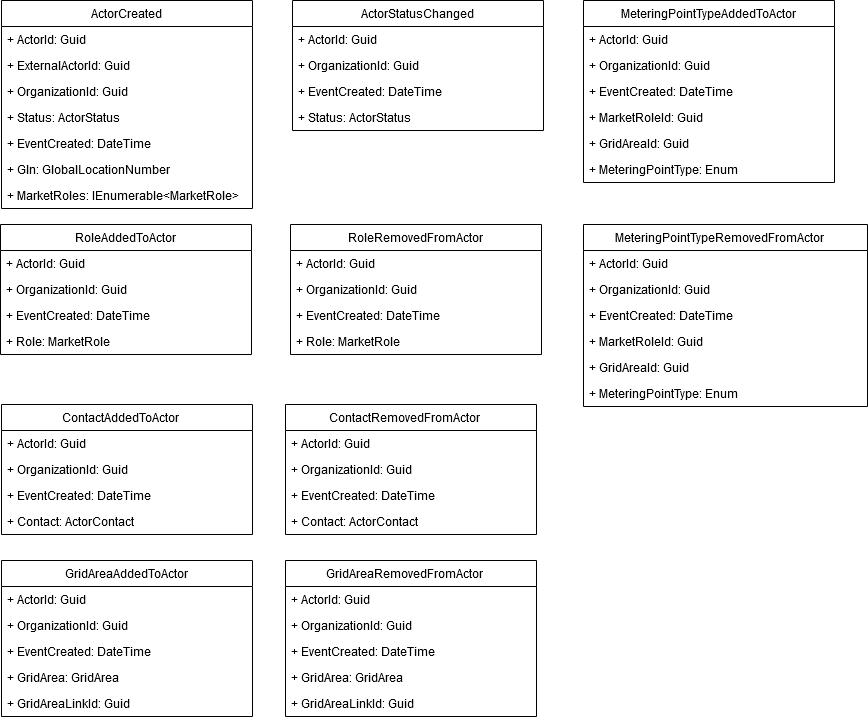
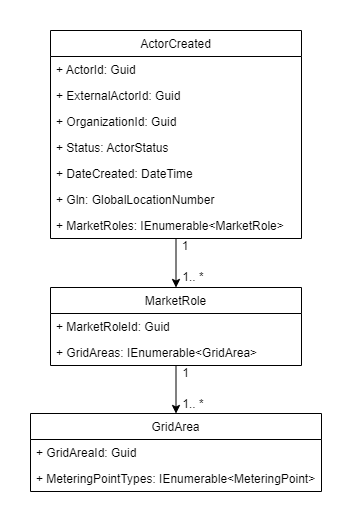
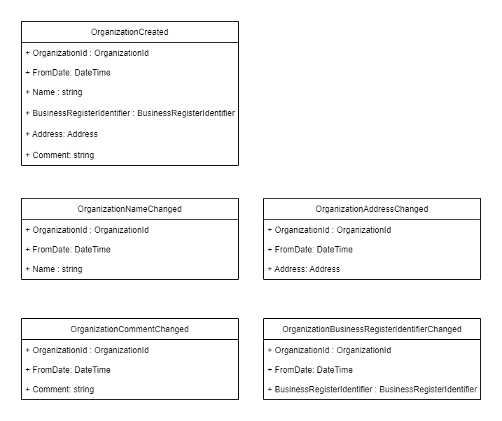
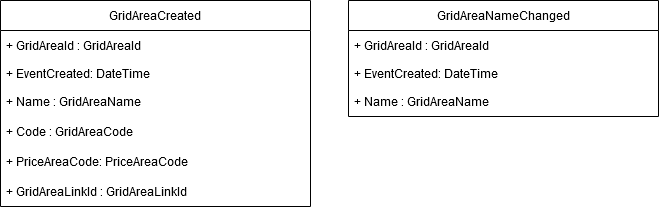

# Business processes

All business processes in the Market Participant domain are documented here.

## Integration events

This section describes flows, how to use integration events and which data are transmitted.

Integration events currently include addition, removal and modification of organizations, actors and grid areas. The image depicted below illustrates how the Market Participant software system handles incoming requests and how other domains can retrieve information from the system. Notice that a timer trigger reads new events from the database every 5 minutes. These events are published to a message queue that other domains can subscribe to.

Fig. 1 - Flow diagram for all integration events

Data transmitted in the events are listed below. Notice that, in the `ActorCreated` event, the type MarketRole contains all information about correlated grid areas and a grid area contains all information about correlated metering point types, as seen on figure 3.

### Actor

Fig. 2 - All integration events regarding an actor

Fig. 3 - Class diagram showing how MarketRoles is associated with GridAreas and MeteringPointTypes

### Organization

Fig. 4 - All integration events regarding an organization

### Grid area

Fig. 5 - All integration events regarding a grid area
